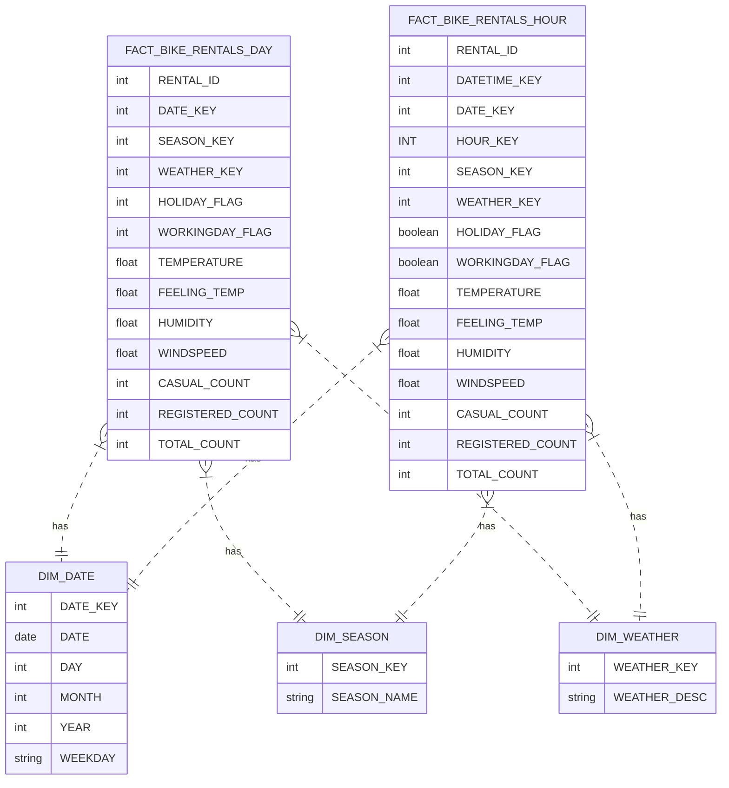

# Bike_sharing
# 🚲 Bike Sharing Data Pipeline with Apache Airflow & Snowflake

Dự án này sử dụng **Apache Airflow**, **Docker** và **Snowflake** để ETL dữ liệu từ file `hour.csv` và `day.csv` thành Data Warehouse trên Snowflake, thực hiện phân tích và theo dõi số liệu liên quan của dữ liệu liên quan đến vấn đề thuê xe.

---

## 📁 Cấu trúc thư mục

```bash
Bike_sharing/
├── airflow/ 
│   ├── dags/                  # DAG Airflow chính
│   |   ├──cleaning/           # Chứa các script xử lý dữ liệu thô
│   |       ├── day_clean.py
│   |       ├── hour_clean.py
│   |       ├── dim_date.py
│   |       ├── dim_hour.py
│   |   ├──data/               # Dữ liệu được đóng gói trong container   
│   |       ├── day.csv
│   │       └── hour.csv
│   |   ├──data_output/        # Dữ liệu sau xử lý được đóng gói trong container
│   |       ├── day_clean.csv
│   |       ├── hour_clean.csv
│   │   ├── clean_day_data.py
│   │   ├── clean_hour_data.py
│   │   ├── load_day_to_snowflake.py
│   │   ├── load_hour_to_snowflake.py
│   │   └── bike_hour_dag.py (DAG gộp tất cả)
│   ├── logs/                   #Ghi lại các tác vụ trong quá trình thực hiện các DAGs 
│   └── plugins/
├── data/                       # Dữ liệu gốc
│   └── bike_sharing/
│       ├── day.csv
│       └── hour.csv
├── data_output/                # Dữ liệu đã làm sạch (output)
│   ├── day_clean.csv
│   └── hour_clean.csv
├── power BI/                   #Chứa file power BI đã trực quan hóa dữ liệu
├── docker-compose.yaml         # Cấu hình Docker
└── README.md                   # Hướng dẫn sử dụng
```

## 📊 Data Warehouse Schema (Star Schema)


#Hướng dẫn:
1.Clone dự án

    git clone https://github.com/datngocc/Bike_sharing.git
    cd Bike_sharing

2.Cấu hình kết nối Snowflake trong Airflow 

    http://localhost:8080

    username: Admin
    password: Admin

3.Tạo connection my_snowflake_conn như sau:

( Vào tab Admin > Connections ➝ Create )

| Field     | Value                                        |
| --------- | -------------------------------------------- |
| Conn Id   | `my_snowflake_conn`                          |
| Conn Type | `Snowflake`                                  |
| Account   | `your_account.region.gcp` *(hoặc aws/azure)* |
| User      | `your_username`                              |
| Password  | `your_password`                              |
| Database  | `BIKESHARE_DW`                               |
| Schema    | `PUBLIC`                                     |
| Warehouse | `COMPUTE_WH`                                 |
| Role      | (tuỳ chọn)                                   |

4.Khởi chạy docker & Airflow

    docker compose up --build

    Truy cập: http://localhost:8080
    Đăng nhập bằng admin/admin

5.Các DAGs có sẵn

| DAG ID                   | Chức năng                          |
| ------------------------ | ---------------------------------- |
| `clean_day_data`         | Làm sạch file `day.csv`            |
| `clean_hour_data`        | Làm sạch file `hour.csv`           |
| `load_day_to_snowflake`  | Tải `day_clean.csv` vào Snowflake  |
| `load_hour_to_snowflake` | Tải `hour_clean.csv` vào Snowflake |
| `bike_hour_dag`          | Chạy toàn bộ pipeline từ A → Z     |

